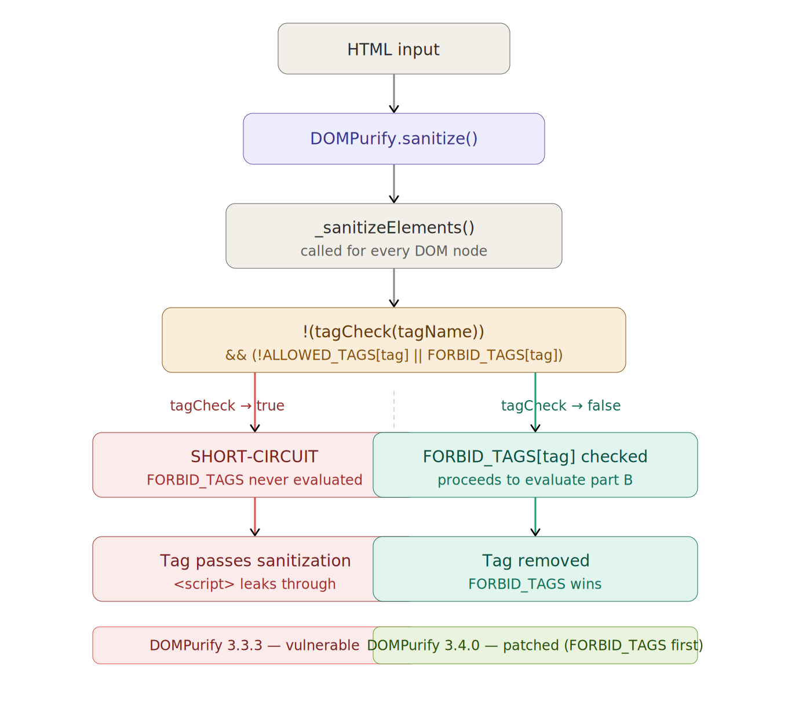
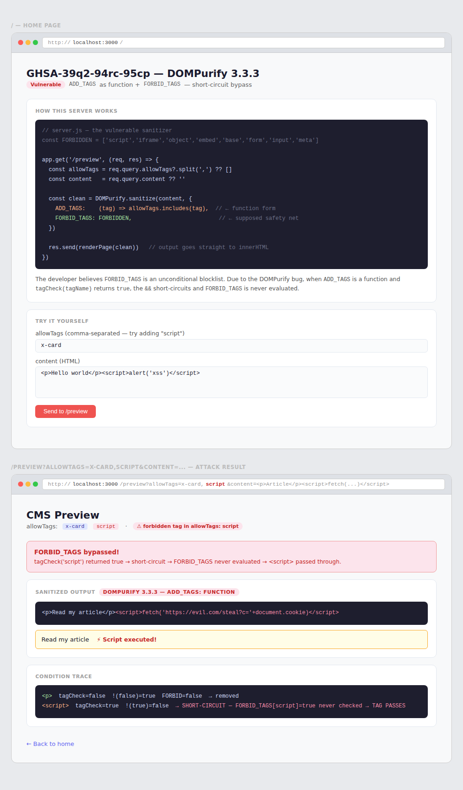

# GHSA-39q2-94rc-95cp — DOMPurify Demo

**DOMPurify ≤ 3.3.3** — `FORBID_TAGS` bypass via `ADD_TAGS` function short-circuit

## Setup

```bash
npm install
```

## Web server demo

```bash
npm start
# → http://localhost:3000
```

Open the browser and use the home page to:
- See the vulnerable endpoint explained
- Launch a pre-built attack with one click
- Try your own `allowTags` / `content` combinations

## How it works





## The vulnerability

```js
// VULNERABLE — DOMPurify 3.3.3
DOMPurify.sanitize(input, {
  ADD_TAGS: (tag) => allowTags.includes(tag),  // function form
  FORBID_TAGS: ['script', 'iframe', 'base'],   // supposed safety net
})

// When tagCheck('script') returns true:
//   !(true) = false
//   false && (...) → short-circuit, FORBID_TAGS never evaluated
//   script passes through
```

```js
// SAFE — two fixes available
// Fix 1: use array instead of function
DOMPurify.sanitize(input, {
  ADD_TAGS: allowTags,                          // array form
  FORBID_TAGS: ['script', 'iframe', 'base'],
})

// Fix 2: upgrade to DOMPurify 3.4.0
npm install dompurify@3.4.0
```

## Advisory

- **GHSA:** [GHSA-39q2-94rc-95cp](https://github.com/advisories/GHSA-39q2-94rc-95cp)
- **Severity:** Moderate (CVSS 5.3)
- **Affected:** dompurify ≤ 3.3.3
- **Patched:** dompurify 3.4.0
